# Abstract

This web application is a demostration of a modern and non-trivial javascript application that helps to design an electrical network composed by feeders, bus bars and circuit breakers, and simulating the power flow of an electrical network.

Recorded video demo:
https://www.youtube.com/watch?v=eann_et7oao

[](https://www.youtube.com/watch?v=eann_et7oao)

Live demo:
http://davps.s3-website-us-east-1.amazonaws.com

Documentation:
http://davps.s3-website-us-east-1.amazonaws.com/docs.html

Source code:
https://github.com/davps/dynamic-breaker-control

### How to run the web app
Just download the code and run it from an http server. It doesn't work if you run it on the browser from the local file (you need localhost or something). 

I usually use this HTTP server for that: https://github.com/indexzero/http-server and if you will use the same server then these are the steps:

1-Install nodejs if you didn't have it already
2-Install http-server npm, with this command:
```
 npm install http-server -g
```
3-Navigate to the root folder of the project from your terminal and type
```
http-server
```
and open the url from your browser.


### Levels of abstraction

#### First level of abstraction

At this level I use libraries. These libraries abstract the HTML DOM, SVG DOM access and ECMAScript APIs from diferent versions. Also, it handles common browser incompatibilities and lack of implementations through a good API.

##### Libraries, frameworks and plugins:

*   jquery
*   jquery-ui
*   jquery.svg.js
*   jquery.svgdom.js
*   jquery.svgplot.js
*   underscore.js
*   bootstrap.js

#### Second level of abstraction

At this level of abstraction I use a flexible framework called backbone.js which offers a minimalist solution to separating concerns in the application. Support for persistence layer and RESTful/JSON sync (ajax), models, views (with controllers), event-driven communication, templating and routing.

##### Libraries, frameworks and plugins:

*   backbone.js
*   backbone.localStorage.js

##### Architecture at this level of abstraction:

At this level, I create several applications independently (called widgets), and, I wire these tiny applications at the next level of abstraction. The files of each tiny application are in different folders (see the folders at `$APPLICATION_ROOT/app/javascript/widgets/`).

##### Most important design patterns used at this level of abstraction:

*   MVVM

#### Third level of abstraction

At this level I use a scalable, event-driven JavaScript architecture for developing widget-based applications, with the help of Aura.js. It takes advantage of patterns and best practices for developing maintainable applications and gives you greater control over widget-based development. Aura gives you complete control of a widget's lifecycle, allowing me to dynamically start, stop, reload and clean-up parts of their application as needed.

##### Libraries, frameworks and plugins:

*   aura.js
*   require.js
*   text.js

##### Folder structure at this level of abstraction:

The following paths contains customized code for aura.js. `$APPLICATION_ROOT/app/javascript/core/`, `$APPLICATION_ROOT/app/javascript/sandbox/` and `$APPLICATION_ROOT/app/javascript/security/`.

##### Most important design patterns used at this level of abstraction:

*   mediator
*   facade
*   publisher/subscriber

### Comments about the implementation of some features

*   **Collision detection:** I implemented my own, custom collision detection system to detect where the circuits are connected when the user drop an equipment at the svg stage (see next item). [\[source code\]](./app/javascript/widgets/single-line-diagram/views/ConectivityView.js)
*   **Drag and drop of electrical equipments represented as svg:** I implemented a very basic and uncomplete drag and drop system to design the topology of the system.

### Folder structure of the project

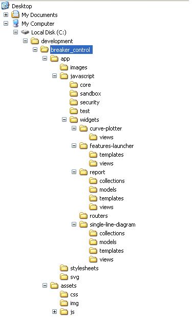

### Tools used on the project

#### IDE: Sublime Text 2

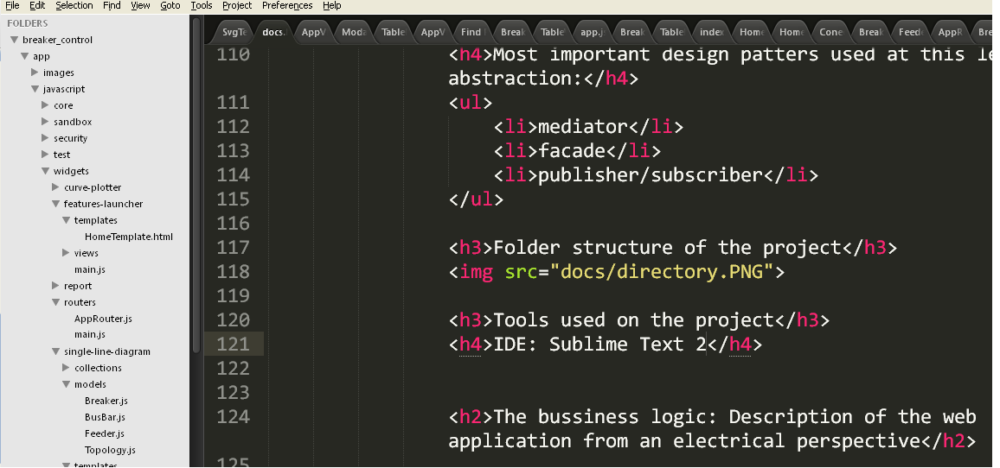

#### SVG Editor: SVG-Edit

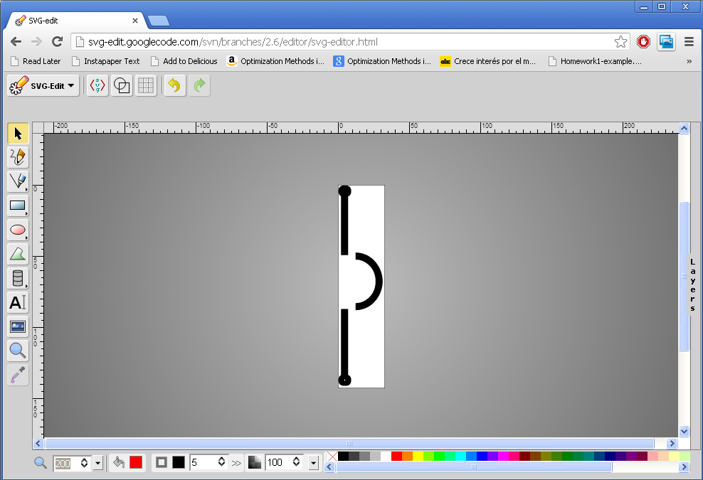 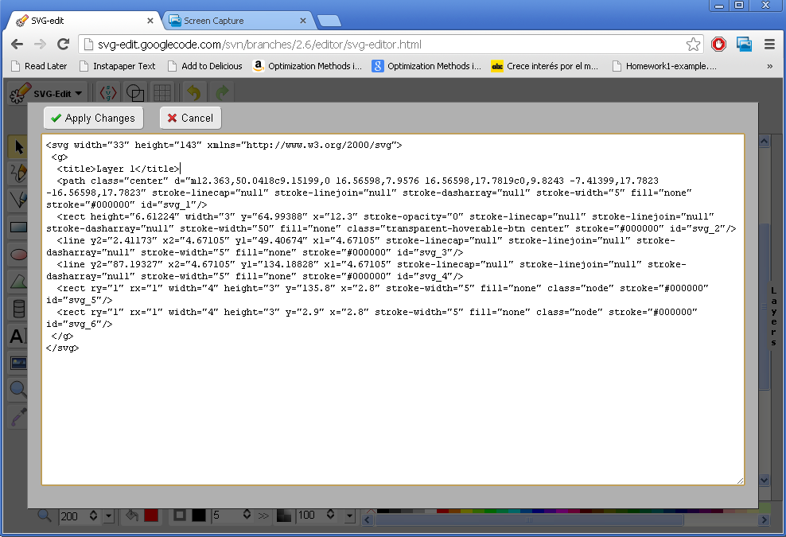

#### Chrome inspector

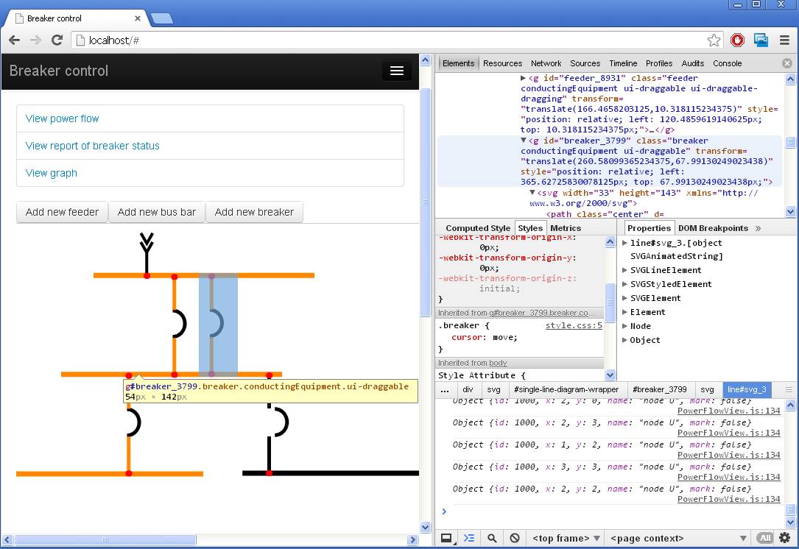 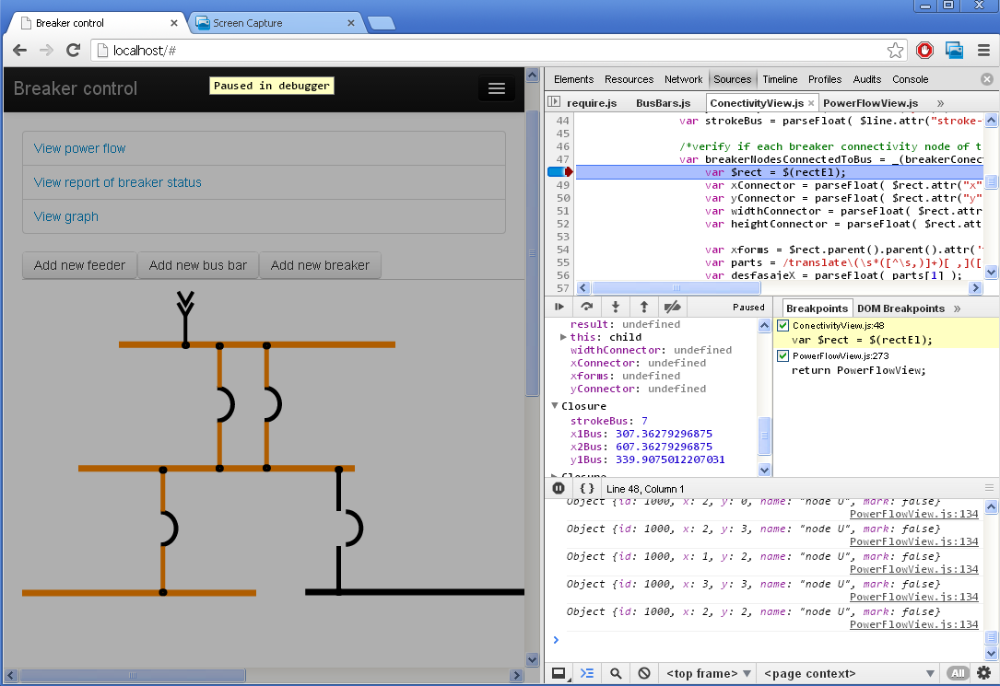

* * *

The bussiness logic: Description of the web application from an electrical perspective
--------------------------------------------------------------------------------------

The widget `single-line-diagram` is the most complex at this application because in order to implement the behaviour of the application a background in power flow analysys and electrical automation are required.

### The requirements

1.  The application must be able to represent circuit breakers, feeders, bus bars.
2.  The user must be able to insert these components
3.  The application can simulate the flow of the power on the busbars connected to one or more feeders in conformance with the Kirchhoff law.
4.  The user must be able to change the status (open|close) of the circuit breakers and run the simulation again.

### The solution of the requirement number 3

In this section I will describe only the requirement number 3, which is the most sofisticated from the electrical engineering perspective.

They are some considerations in order to plot consistently (in all the cases) a simulated state of an electrical topology designed dynamically by the user. In order to solve that, I am using some mathematical tools from power analysis:

1.  Kirchhoff's circuit laws
2.  Theory of electrical power flow and its underlying math (graph theory), including:

*   Incidence matrix
*   Connected component (I am not sure about the translation. In spanish, we call it "gráficos conexos")

Basically, I calculate the incidence matrix of the electrical topology designed dynamically by the user, verify on which bus bar (vertex) the feeder is connected, and then I populate and paint each vertex of the graph starting from the feeder vertex. I populate the graph using a computational algorithm called BFS (breadth-first search). So, each connected graph that contains a feeder will be energized, and the isolated graphs without feeders will be not energized. [\[source](./app/javascript/widgets/single-line-diagram/views/PowerFlowView.js) [code\]](./app/javascript/widgets/single-line-diagram/models/Topology.js)

### Related work

[**Patent**: Feeder automation for an electric power distribution system](http://www.google.com/patents/US8121740), by ABB Research Ltd.

### Screenshots of the project

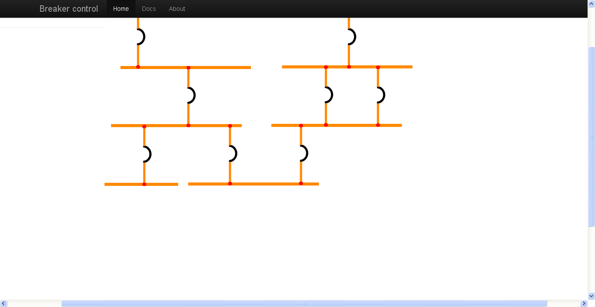 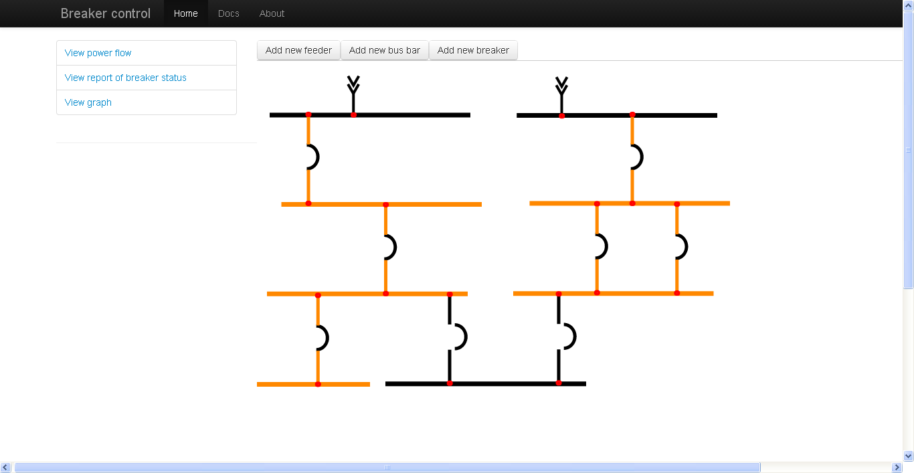 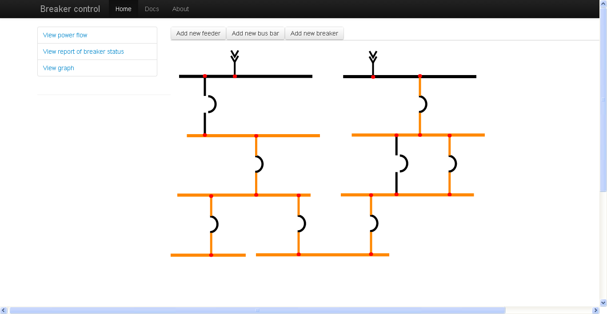 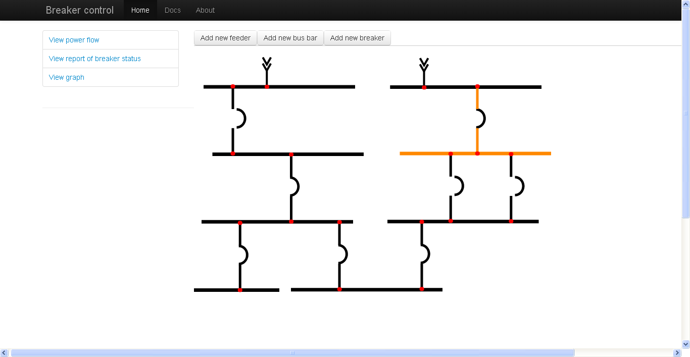 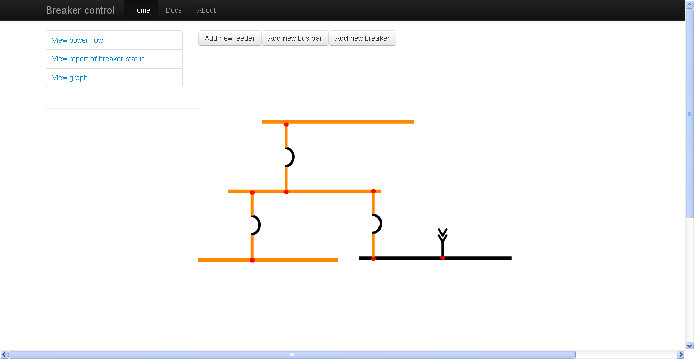 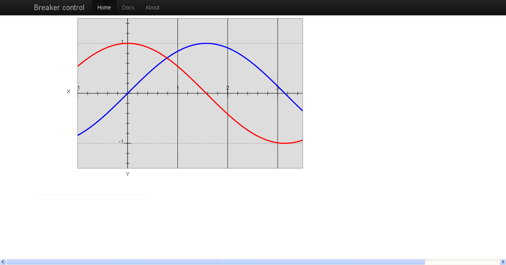 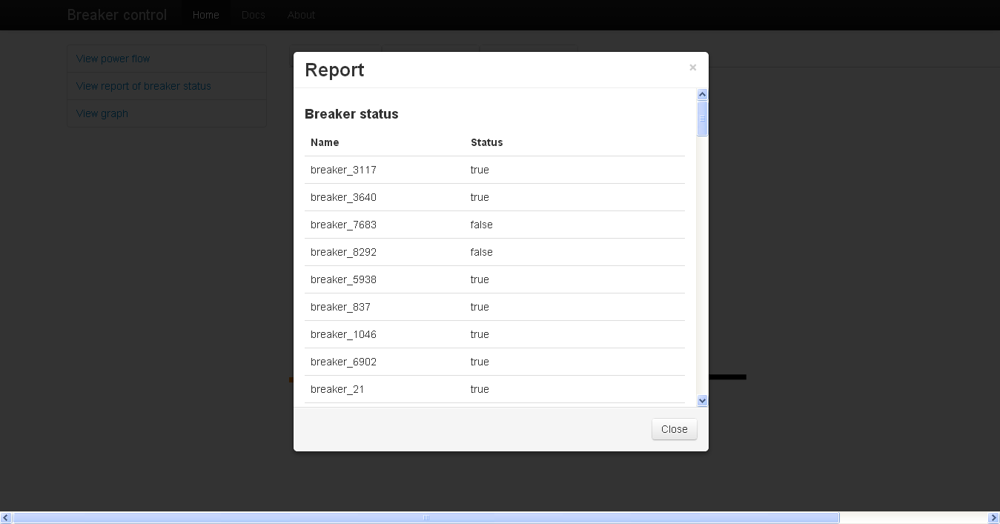

### Bugs to be fixed

*   The drag and drop of electrical components doesn't work properly when you scroll the page

### Browser compatibility

Considering that this is just a demostration and not a production code, this application was tested only in Chromium 27.0.1423.0 (184476).

* * *

© David Daniel Perez Sosa 2013

